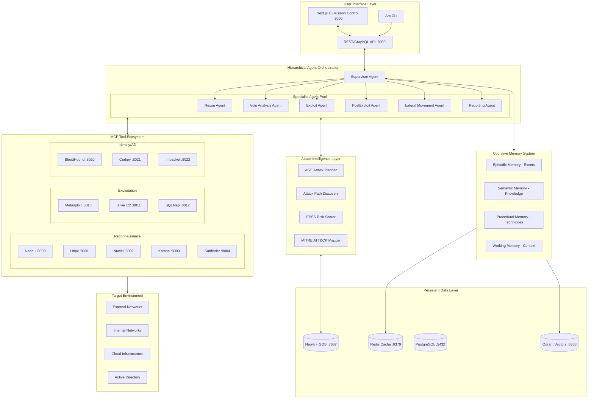
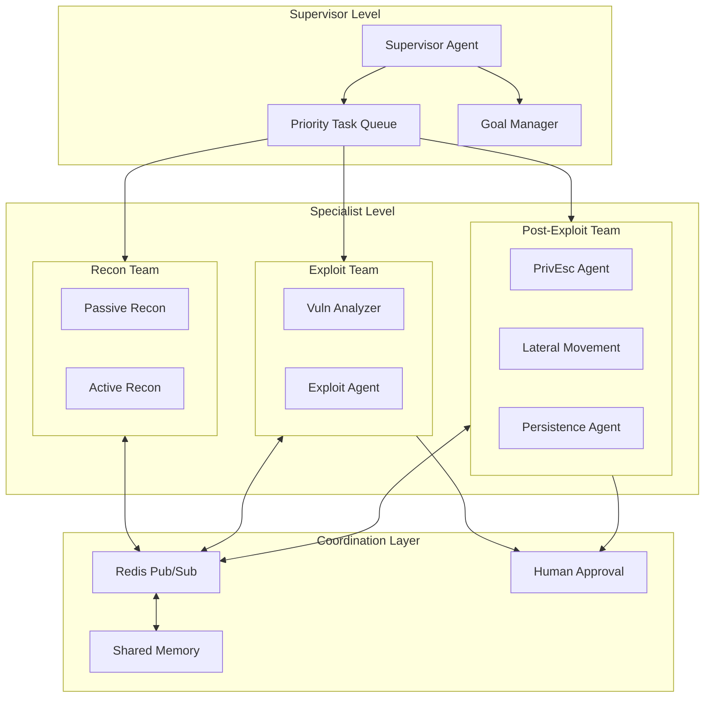
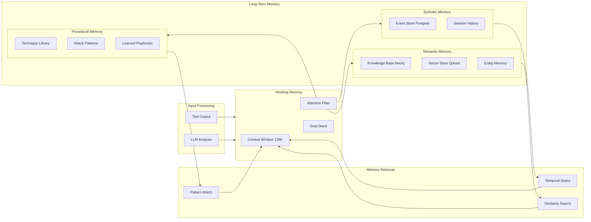
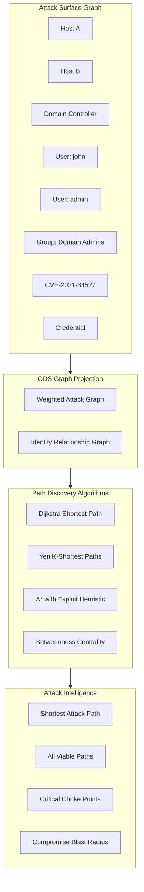
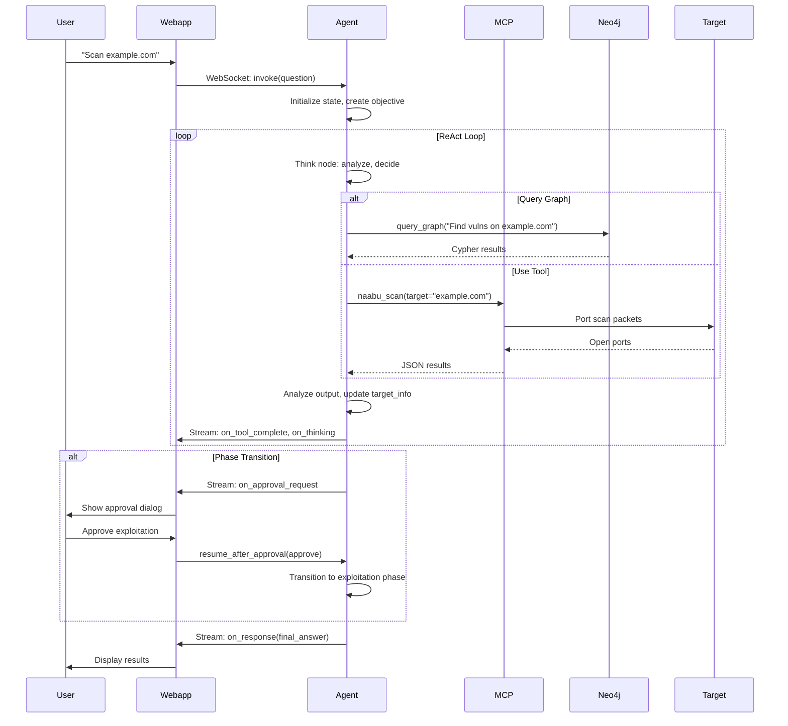

# Arc - Enterprise Autonomous AI Red Team Framework

## Executive Summary

Arc is a next-generation autonomous penetration testing platform that combines:

- **Hierarchical Multi-Agent AI** with specialized agents for each attack phase
- **Cognitive Memory Architecture** for learning across engagements
- **Graph-Based Attack Intelligence** with Neo4j GDS for path discovery
- **MITRE ATT&CK Integration** for adversary emulation and TTP mapping
- **ML-Powered Prioritization** using EPSS for exploit prediction
- **BloodHound-Style Analysis** for identity attack paths
- **C2 Framework Integration** for persistent access operations

## High-Level Architecture




## Project Structure (Enterprise Scale)

```
arc/
├── core/                           # Core Framework
│   ├── __init__.py
│   ├── config.py                   # Global configuration
│   ├── exceptions.py               # Custom exceptions
│   └── constants.py                # System constants
│
├── agents/                         # Hierarchical Multi-Agent System
│   ├── supervisor/
│   │   ├── supervisor_agent.py     # Top-level orchestrator
│   │   ├── task_router.py          # Dynamic task routing
│   │   ├── priority_queue.py       # Mission priority management
│   │   └── state.py                # Supervisor state
│   │
│   ├── specialists/
│   │   ├── recon_agent.py          # Reconnaissance specialist
│   │   ├── vuln_agent.py           # Vulnerability analysis
│   │   ├── exploit_agent.py        # Exploitation specialist
│   │   ├── post_exploit_agent.py   # Post-exploitation ops
│   │   ├── pivot_agent.py          # Lateral movement
│   │   ├── persistence_agent.py    # Persistence mechanisms
│   │   ├── exfil_agent.py          # Data exfiltration
│   │   └── report_agent.py         # Report generation
│   │
│   ├── shared/
│   │   ├── base_agent.py           # Agent base class
│   │   ├── agent_protocol.py       # Inter-agent messaging
│   │   ├── tool_executor.py        # Phase-aware tool execution
│   │   └── approval_gate.py        # Human approval checkpoints
│   │
│   └── graphs/
│       ├── supervisor_graph.py     # LangGraph supervisor
│       ├── recon_subgraph.py       # Recon workflow
│       ├── exploit_subgraph.py     # Exploit workflow
│       └── post_exploit_subgraph.py
│
├── memory/                         # Cognitive Memory Architecture
│   ├── episodic/
│   │   ├── event_store.py          # Event logging
│   │   ├── session_memory.py       # Session-scoped memory
│   │   └── retrieval.py            # Temporal retrieval
│   │
│   ├── semantic/
│   │   ├── knowledge_base.py       # Structured knowledge
│   │   ├── vector_store.py         # Qdrant embeddings
│   │   ├── entity_memory.py        # Entity relationships
│   │   └── cve_knowledge.py        # CVE/exploit knowledge
│   │
│   ├── procedural/
│   │   ├── technique_library.py    # Attack techniques
│   │   ├── exploit_patterns.py     # Successful exploit patterns
│   │   ├── playbook_memory.py      # Learned playbooks
│   │   └── failure_memory.py       # Failed attempts (what not to do)
│   │
│   └── working/
│       ├── context_manager.py      # Active context window
│       ├── goal_stack.py           # Hierarchical goals
│       └── attention.py            # Focus management
│
├── intelligence/                   # Attack Intelligence Engine
│   ├── planner/
│   │   ├── age_planner.py          # AGE graph attack planner
│   │   ├── mission_planner.py      # High-level mission planning
│   │   ├── tactic_planner.py       # Tactical planning
│   │   └── contingency.py          # Backup plan generation
│   │
│   ├── pathfinding/
│   │   ├── attack_path_finder.py   # Neo4j GDS path discovery
│   │   ├── dijkstra_paths.py       # Shortest attack paths
│   │   ├── yen_k_paths.py          # K-shortest paths
│   │   ├── choke_points.py         # Critical node analysis
│   │   └── blast_radius.py         # Impact assessment
│   │
│   ├── scoring/
│   │   ├── epss_client.py          # FIRST EPSS API
│   │   ├── risk_scorer.py          # Composite risk scoring
│   │   ├── exploitability.py       # Exploit likelihood
│   │   └── impact_calculator.py    # Business impact
│   │
│   ├── mitre/
│   │   ├── attack_mapper.py        # TTP mapping
│   │   ├── caldera_client.py       # CALDERA integration
│   │   ├── technique_selector.py   # Technique recommendation
│   │   └── coverage_analyzer.py    # ATT&CK coverage
│   │
│   └── identity/
│       ├── bloodhound_engine.py    # BloodHound-style analysis
│       ├── ad_path_finder.py       # AD attack paths
│       ├── azure_paths.py          # Azure AD paths
│       ├── privilege_paths.py      # Privilege escalation
│       └── kerberos_attacks.py     # Kerberoasting, etc.
│
├── mcp/                            # MCP Tool Servers (20+ tools)
│   ├── servers/
│   │   ├── recon/
│   │   │   ├── naabu_server.py
│   │   │   ├── httpx_server.py
│   │   │   ├── subfinder_server.py
│   │   │   ├── katana_server.py
│   │   │   ├── gau_server.py
│   │   │   ├── kiterunner_server.py
│   │   │   └── shodan_server.py
│   │   │
│   │   ├── vuln/
│   │   │   ├── nuclei_server.py
│   │   │   ├── gvm_server.py
│   │   │   └── nikto_server.py
│   │   │
│   │   ├── exploit/
│   │   │   ├── metasploit_server.py
│   │   │   ├── sqlmap_server.py
│   │   │   └── commix_server.py
│   │   │
│   │   ├── c2/
│   │   │   ├── sliver_server.py    # Sliver C2 integration
│   │   │   └── havoc_server.py     # Havoc C2 (optional)
│   │   │
│   │   ├── ad/
│   │   │   ├── bloodhound_server.py
│   │   │   ├── certipy_server.py
│   │   │   ├── impacket_server.py
│   │   │   └── crackmapexec_server.py
│   │   │
│   │   └── utils/
│   │       ├── curl_server.py
│   │       ├── proxychains_server.py
│   │       └── tor_server.py
│   │
│   ├── registry.py                 # Tool registry
│   ├── health_check.py             # Server health monitoring
│   └── docker-compose.yml
│
├── graph/                          # Neo4j + GDS Integration
│   ├── schema/
│   │   ├── core_schema.cypher      # Core attack surface
│   │   ├── mitre_schema.cypher     # ATT&CK schema
│   │   ├── identity_schema.cypher  # AD/Azure schema
│   │   ├── attack_graph_schema.cypher
│   │   └── indexes.cypher
│   │
│   ├── projections/
│   │   ├── attack_surface.py       # GDS graph projections
│   │   ├── identity_graph.py
│   │   └── vuln_chain.py
│   │
│   ├── algorithms/
│   │   ├── shortest_path.py        # Dijkstra attack paths
│   │   ├── all_paths.py            # All possible paths
│   │   ├── centrality.py           # Critical node detection
│   │   ├── community.py            # Network segmentation
│   │   └── similarity.py           # Similar attack patterns
│   │
│   ├── queries/
│   │   ├── text_to_cypher.py       # LLM Cypher generation
│   │   ├── attack_queries.py       # Predefined attack queries
│   │   └── reporting_queries.py
│   │
│   └── client.py                   # Neo4j async client
│
├── recon/                          # Advanced Reconnaissance
│   ├── passive/
│   │   ├── osint_collector.py      # OSINT aggregation
│   │   ├── cert_transparency.py    # crt.sh, Censys
│   │   ├── dns_passive.py          # Passive DNS
│   │   ├── shodan_passive.py       # Shodan InternetDB
│   │   └── github_recon.py         # GitHub dorking
│   │
│   ├── active/
│   │   ├── subdomain_enum.py       # Active enumeration
│   │   ├── port_scanner.py         # Naabu + masscan
│   │   ├── service_fingerprint.py  # Banner grabbing
│   │   ├── http_probe.py           # Httpx probing
│   │   └── web_crawler.py          # Katana + custom
│   │
│   ├── continuous/
│   │   ├── monitor.py              # Continuous monitoring
│   │   ├── diff_detector.py        # Change detection
│   │   └── alerting.py             # New asset alerts
│   │
│   └── stealth/
│       ├── rate_limiter.py         # Scan throttling
│       ├── tor_wrapper.py          # Tor integration
│       └── decoy_traffic.py        # Traffic obfuscation
│
├── api/                            # API Layer
│   ├── rest/
│   │   ├── main.py                 # FastAPI app
│   │   ├── routes/
│   │   │   ├── missions.py         # Mission CRUD
│   │   │   ├── agents.py           # Agent status
│   │   │   ├── targets.py          # Target management
│   │   │   ├── findings.py         # Vulnerability findings
│   │   │   └── reports.py          # Report generation
│   │   └── middleware/
│   │       ├── auth.py             # JWT authentication
│   │       └── rate_limit.py
│   │
│   ├── websocket/
│   │   ├── handler.py              # WebSocket manager
│   │   ├── events.py               # Event definitions
│   │   └── streams.py              # Real-time streaming
│   │
│   └── graphql/
│       ├── schema.py               # GraphQL schema
│       └── resolvers.py
│
├── webapp/                         # Mission Control UI
│   ├── src/
│   │   ├── app/
│   │   │   ├── page.tsx            # Dashboard
│   │   │   ├── missions/           # Mission management
│   │   │   ├── chat/               # AI operator interface
│   │   │   ├── graph/              # 3D graph visualization
│   │   │   ├── attack-paths/       # Attack path explorer
│   │   │   ├── identity/           # BloodHound-style view
│   │   │   ├── timeline/           # Attack timeline
│   │   │   └── reports/            # Report viewer
│   │   │
│   │   ├── components/
│   │   │   ├── graph/
│   │   │   │   ├── ForceGraph3D.tsx
│   │   │   │   ├── AttackPathAnimator.tsx
│   │   │   │   └── IdentityGraph.tsx
│   │   │   ├── chat/
│   │   │   │   ├── AgentChat.tsx
│   │   │   │   ├── ThinkingIndicator.tsx
│   │   │   │   └── ToolExecution.tsx
│   │   │   ├── approval/
│   │   │   │   ├── ApprovalQueue.tsx
│   │   │   │   └── RiskAssessment.tsx
│   │   │   └── dashboard/
│   │   │       ├── MissionStatus.tsx
│   │   │       ├── RiskHeatmap.tsx
│   │   │       └── AttackProgress.tsx
│   │   │
│   │   └── lib/
│   │       ├── websocket.ts
│   │       ├── neo4j.ts
│   │       └── d3-force-3d.ts
│   │
│   └── package.json
│
├── reporting/                      # Automated Reporting
│   ├── generators/
│   │   ├── executive_summary.py
│   │   ├── technical_report.py
│   │   ├── remediation_plan.py
│   │   └── compliance_report.py
│   │
│   ├── templates/
│   │   ├── pentest_report.md
│   │   ├── attack_narrative.md
│   │   └── findings_table.md
│   │
│   └── exporters/
│       ├── pdf_exporter.py
│       ├── json_exporter.py
│       └── sarif_exporter.py       # SARIF for CI/CD
│
├── lab/                            # Comprehensive Test Lab
│   ├── vulnerable_apps/
│   │   ├── dvwa/
│   │   ├── juice-shop/
│   │   ├── webgoat/
│   │   ├── hackazon/
│   │   └── vulnhub-vms/
│   │
│   ├── ad_lab/
│   │   ├── domain_controller/
│   │   ├── member_servers/
│   │   ├── workstations/
│   │   └── azure_ad_sync/
│   │
│   ├── cloud_sim/
│   │   ├── localstack/             # AWS simulation
│   │   └── azurite/                # Azure simulation
│   │
│   └── network/
│       ├── segmented_network/
│       └── flat_network/
│
├── docker-compose.yml              # Full stack orchestration
├── docker-compose.dev.yml          # Development
├── docker-compose.lab.yml          # Lab environment
├── Makefile
├── pyproject.toml
└── README.md
```

## Core Components (Deep Dive)

### 1. Hierarchical Multi-Agent System

Arc uses a **Supervisor Pattern** with specialized agents, inspired by LangGraph's hierarchical architecture.




**Supervisor Agent Implementation:**

```python
from langgraph.graph import StateGraph, START, END
from langgraph_supervisor import create_supervisor

class SupervisorAgent:
    """
    Top-level orchestrator using LangGraph Supervisor pattern.
    Routes tasks to specialist agents based on mission phase.
    """
    
    def __init__(self, llm: ChatOpenAI):
        self.llm = llm
        self.specialists = {
            "recon": ReconAgent(),
            "vuln_analysis": VulnAnalysisAgent(),
            "exploit": ExploitAgent(),
            "post_exploit": PostExploitAgent(),
            "lateral": LateralMovementAgent(),
            "report": ReportAgent(),
        }
        self.graph = self._build_graph()
    
    def _build_graph(self) -> CompiledGraph:
        # Create supervisor with specialist handoff
        return create_supervisor(
            agents=list(self.specialists.values()),
            model=self.llm,
            prompt=SUPERVISOR_SYSTEM_PROMPT,
            # Enable parallel execution for independent tasks
            parallel_tool_calls=True,
        ).compile(checkpointer=MemorySaver())
    
    async def execute_mission(self, mission: Mission) -> MissionResult:
        """Execute a full penetration test mission."""
        config = {"configurable": {"thread_id": mission.id}}
        
        async for event in self.graph.astream(
            {"messages": [HumanMessage(content=mission.objective)]},
            config,
            stream_mode="values"
        ):
            yield self._process_event(event)
```

**Agent State with Shared Memory:**

```python
class AgentState(TypedDict):
    # Core messaging
    messages: Annotated[list, add_messages]
    
    # Mission tracking
    mission_id: str
    current_phase: Phase  # recon | vuln_analysis | exploitation | post_exploitation | lateral | reporting
    phase_history: List[PhaseTransition]
    
    # Hierarchical goals
    strategic_goals: List[Goal]      # Mission-level (e.g., "Compromise domain admin")
    tactical_goals: List[Goal]       # Phase-level (e.g., "Enumerate AD users")
    operational_goals: List[Goal]    # Task-level (e.g., "Run BloodHound collection")
    
    # Shared intelligence
    attack_surface: AttackSurface
    discovered_vulns: List[Vulnerability]
    active_sessions: List[Session]
    compromised_hosts: List[Host]
    harvested_creds: List[Credential]
    
    # Memory references
    episodic_refs: List[str]         # Event IDs for retrieval
    semantic_refs: List[str]         # Knowledge chunk IDs
    procedural_refs: List[str]       # Technique IDs
    
    # Coordination
    pending_approvals: List[ApprovalRequest]
    agent_messages: List[InterAgentMessage]
```

### 2. Cognitive Memory Architecture

Arc implements a **three-tier memory system** inspired by human cognition and TermiAgent's Located Memory Activation.




**Memory Implementation:**

```python
class CognitiveMemory:
    """
    Unified memory interface with Located Memory Activation.
    Prevents context forgetting during long multi-step operations.
    """
    
    def __init__(self):
        self.episodic = EpisodicMemory(postgres_client)
        self.semantic = SemanticMemory(neo4j_client, qdrant_client)
        self.procedural = ProceduralMemory()
        self.working = WorkingMemory(max_tokens=128000)
    
    async def remember(self, observation: Observation) -> None:
        """Store observation in appropriate memory stores."""
        # Episodic: Raw event with timestamp
        event_id = await self.episodic.store_event(
            timestamp=observation.timestamp,
            agent_id=observation.agent_id,
            tool_name=observation.tool,
            input_args=observation.args,
            output=observation.output,
            success=observation.success,
        )
        
        # Semantic: Extract and link entities
        entities = await self._extract_entities(observation)
        for entity in entities:
            await self.semantic.upsert_entity(entity)
            await self.semantic.link_to_event(entity.id, event_id)
        
        # Procedural: Learn from successful exploits
        if observation.tool in EXPLOIT_TOOLS and observation.success:
            await self.procedural.record_success(
                technique=observation.technique,
                context=observation.context,
                payload=observation.args,
            )
    
    async def recall(self, query: str, context: Context) -> MemoryBundle:
        """
        Located Memory Activation: Retrieve relevant memories
        based on current context and query.
        """
        # Episodic: Recent events in this session
        recent_events = await self.episodic.get_session_events(
            session_id=context.session_id,
            limit=50
        )
        
        # Semantic: Similar knowledge chunks
        knowledge = await self.semantic.similarity_search(
            query=query,
            filters={"target": context.current_target},
            limit=10
        )
        
        # Procedural: Relevant techniques for current phase
        techniques = await self.procedural.get_techniques(
            phase=context.current_phase,
            target_type=context.target_type,
            available_tools=context.available_tools,
        )
        
        return MemoryBundle(
            episodic=recent_events,
            semantic=knowledge,
            procedural=techniques,
        )
```

### 3. Attack Path Discovery with Neo4j GDS

Arc uses Neo4j Graph Data Science for **BloodHound-style attack path analysis**.




**Attack Path Finder:**

```python
class AttackPathFinder:
    """
    Neo4j GDS-powered attack path discovery.
    Finds shortest/all paths from current position to target.
    """
    
    def __init__(self, neo4j_client: Neo4jClient):
        self.client = neo4j_client
        self.gds = GraphDataScience(neo4j_client.driver)
    
    async def create_attack_projection(self, project_id: str) -> str:
        """Create GDS graph projection for attack path analysis."""
        projection_name = f"attack_graph_{project_id}"
        
        await self.gds.graph.project(
            projection_name,
            # Node projection with attack-relevant properties
            node_spec={
                "Host": {"properties": ["compromised", "criticality"]},
                "User": {"properties": ["privileged", "active"]},
                "Vulnerability": {"properties": ["epss_score", "cvss"]},
                "Credential": {"properties": ["type", "valid"]},
            },
            # Relationship projection with exploit costs
            relationship_spec={
                "CAN_EXPLOIT": {"properties": ["difficulty", "stealth"]},
                "HAS_ACCESS": {"properties": ["permission_level"]},
                "MEMBER_OF": {},
                "ADMIN_TO": {},
                "CAN_RDPINTO": {},
                "CAN_PSREMOTE": {},
            }
        )
        return projection_name
    
    async def find_shortest_attack_path(
        self,
        source: str,  # Current compromised host/user
        target: str,  # Target (e.g., "Domain Admin", specific host)
        project_id: str,
    ) -> AttackPath:
        """Find shortest path using Dijkstra with exploit difficulty weights."""
        projection = f"attack_graph_{project_id}"
        
        result = await self.gds.shortestPath.dijkstra.stream(
            projection,
            sourceNode=source,
            targetNode=target,
            relationshipWeightProperty="difficulty",
        )
        
        return AttackPath(
            nodes=result["nodeIds"],
            relationships=result["relationships"],
            total_cost=result["totalCost"],
            path_length=len(result["nodeIds"]),
        )
    
    async def find_all_attack_paths(
        self,
        source: str,
        target: str,
        project_id: str,
        max_paths: int = 10,
    ) -> List[AttackPath]:
        """Find K-shortest paths using Yen's algorithm."""
        projection = f"attack_graph_{project_id}"
        
        results = await self.gds.shortestPath.yens.stream(
            projection,
            sourceNode=source,
            targetNode=target,
            k=max_paths,
            relationshipWeightProperty="difficulty",
        )
        
        return [AttackPath.from_gds_result(r) for r in results]
    
    async def find_choke_points(self, project_id: str) -> List[ChokePoint]:
        """
        Find critical nodes using betweenness centrality.
        These are high-value targets that cut many attack paths.
        """
        projection = f"attack_graph_{project_id}"
        
        results = await self.gds.betweenness.stream(projection)
        
        # Top 10 nodes by centrality = choke points
        choke_points = sorted(results, key=lambda x: x["score"], reverse=True)[:10]
        
        return [
            ChokePoint(
                node_id=cp["nodeId"],
                centrality_score=cp["score"],
                paths_through=await self._count_paths_through(cp["nodeId"]),
            )
            for cp in choke_points
        ]
    
    async def calculate_blast_radius(
        self,
        compromised_node: str,
        project_id: str,
    ) -> BlastRadius:
        """Calculate impact of compromising a specific node."""
        projection = f"attack_graph_{project_id}"
        
        # BFS to find all reachable nodes
        reachable = await self.gds.bfs.stream(
            projection,
            sourceNode=compromised_node,
            maxDepth=5,
        )
        
        return BlastRadius(
            source=compromised_node,
            reachable_hosts=len([n for n in reachable if n["label"] == "Host"]),
            reachable_users=len([n for n in reachable if n["label"] == "User"]),
            reachable_data=len([n for n in reachable if n["label"] == "Data"]),
            critical_assets_at_risk=[n for n in reachable if n.get("criticality") == "high"],
        )
```

### 4. EPSS-Powered Vulnerability Prioritization

Arc integrates FIRST's **Exploit Prediction Scoring System** for ML-based prioritization.

```python
class EPSSScorer:
    """
    ML-based vulnerability prioritization using EPSS.
    Predicts probability of exploitation in next 30 days.
    """
    
    EPSS_API = "https://api.first.org/data/v1/epss"
    
    async def score_vulnerabilities(
        self,
        cves: List[str],
    ) -> Dict[str, EPSSScore]:
        """Fetch EPSS scores for CVE list."""
        async with aiohttp.ClientSession() as session:
            async with session.get(
                self.EPSS_API,
                params={"cve": ",".join(cves)}
            ) as response:
                data = await response.json()
        
        return {
            item["cve"]: EPSSScore(
                cve=item["cve"],
                epss=float(item["epss"]),         # Probability 0-1
                percentile=float(item["percentile"]),  # Relative ranking
                date=item["date"],
            )
            for item in data["data"]
        }
    
    def prioritize(
        self,
        vulnerabilities: List[Vulnerability],
        epss_scores: Dict[str, EPSSScore],
    ) -> List[PrioritizedVuln]:
        """
        Composite scoring combining EPSS, CVSS, and context.
        
        Formula:
        priority = (EPSS * 0.4) + (CVSS_normalized * 0.3) + (context_score * 0.3)
        """
        prioritized = []
        
        for vuln in vulnerabilities:
            epss = epss_scores.get(vuln.cve_id)
            
            # EPSS component (40% weight) - exploit likelihood
            epss_component = (epss.epss if epss else 0.1) * 0.4
            
            # CVSS component (30% weight) - severity
            cvss_normalized = (vuln.cvss_score / 10.0) * 0.3
            
            # Context component (30% weight) - business impact
            context_score = self._calculate_context_score(vuln) * 0.3
            
            priority_score = epss_component + cvss_normalized + context_score
            
            prioritized.append(PrioritizedVuln(
                vulnerability=vuln,
                epss_score=epss,
                priority_score=priority_score,
                recommended_action=self._recommend_action(priority_score, epss),
            ))
        
        return sorted(prioritized, key=lambda x: x.priority_score, reverse=True)
    
    def _calculate_context_score(self, vuln: Vulnerability) -> float:
        """Context-aware scoring based on asset criticality and exposure."""
        score = 0.5  # Base score
        
        # Internet-facing asset boost
        if vuln.asset.is_internet_facing:
            score += 0.2
        
        # Critical asset boost
        if vuln.asset.criticality == "high":
            score += 0.2
        
        # Known exploit in the wild
        if vuln.has_public_exploit:
            score += 0.1
        
        return min(score, 1.0)
```

### 5. MITRE ATT&CK Integration & Adversary Emulation

Arc maps all activities to MITRE ATT&CK TTPs and supports CALDERA integration.

```python
class MITREAttackMapper:
    """
    Maps agent actions to MITRE ATT&CK framework.
    Enables adversary emulation and coverage analysis.
    """
    
    def __init__(self):
        self.attack_data = self._load_attack_stix()
        self.technique_map = self._build_technique_map()
    
    def map_tool_to_techniques(self, tool_name: str, args: dict) -> List[Technique]:
        """Map tool execution to ATT&CK techniques."""
        mappings = {
            "naabu_scan": [
                Technique(id="T1046", name="Network Service Discovery"),
            ],
            "bloodhound_collect": [
                Technique(id="T1087.002", name="Domain Account Discovery"),
                Technique(id="T1069.002", name="Domain Groups Discovery"),
                Technique(id="T1018", name="Remote System Discovery"),
            ],
            "mimikatz_sekurlsa": [
                Technique(id="T1003.001", name="LSASS Memory"),
            ],
            "kerberoast": [
                Technique(id="T1558.003", name="Kerberoasting"),
            ],
            "psexec": [
                Technique(id="T1569.002", name="Service Execution"),
                Technique(id="T1021.002", name="SMB/Windows Admin Shares"),
            ],
        }
        return mappings.get(tool_name, [])
    
    async def generate_attack_narrative(
        self,
        execution_trace: List[ExecutionStep],
    ) -> AttackNarrative:
        """Generate ATT&CK-aligned attack narrative for reporting."""
        tactics_used = defaultdict(list)
        
        for step in execution_trace:
            techniques = self.map_tool_to_techniques(step.tool_name, step.args)
            for tech in techniques:
                tactic = self._get_tactic_for_technique(tech.id)
                tactics_used[tactic].append(tech)
        
        return AttackNarrative(
            kill_chain=[
                TacticPhase(
                    tactic=tactic,
                    techniques=techs,
                    timestamp=self._get_first_use_time(techs, execution_trace),
                )
                for tactic, techs in tactics_used.items()
            ],
            coverage_score=self._calculate_coverage(tactics_used),
            attack_flow_diagram=self._generate_mermaid(tactics_used),
        )


class CALDERAIntegration:
    """
    Integration with MITRE CALDERA for adversary emulation.
    """
    
    def __init__(self, caldera_url: str, api_key: str):
        self.url = caldera_url
        self.api_key = api_key
    
    async def create_adversary_profile(
        self,
        name: str,
        techniques: List[str],
    ) -> str:
        """Create adversary profile from discovered techniques."""
        abilities = await self._get_abilities_for_techniques(techniques)
        
        async with aiohttp.ClientSession() as session:
            response = await session.post(
                f"{self.url}/api/v2/adversaries",
                headers={"KEY": self.api_key},
                json={
                    "name": name,
                    "description": f"Auto-generated by Arc",
                    "atomic_ordering": abilities,
                }
            )
            data = await response.json()
            return data["adversary_id"]
    
    async def run_operation(
        self,
        adversary_id: str,
        group: str,
    ) -> AsyncIterator[OperationEvent]:
        """Run CALDERA operation and stream results."""
        operation_id = await self._start_operation(adversary_id, group)
        
        async for event in self._stream_operation(operation_id):
            yield event
```

### 6. C2 Framework Integration (Sliver)

Arc integrates with **Sliver C2** for persistent access and advanced post-exploitation.

```python
class SliverC2Client:
    """
    Sliver C2 integration for persistent access operations.
    """
    
    def __init__(self, config_path: str):
        self.config = SliverClientConfig.parse_file(config_path)
        self.client = None
    
    async def connect(self) -> None:
        """Establish gRPC connection to Sliver server."""
        self.client = SliverClient(self.config)
        await self.client.connect()
    
    async def generate_implant(
        self,
        target_os: str,
        target_arch: str,
        c2_urls: List[str],
        format: str = "exe",
    ) -> bytes:
        """Generate Sliver implant for target."""
        implant = await self.client.generate_implant(
            name=f"arc-{uuid4().hex[:8]}",
            mtls=c2_urls,
            os=target_os,
            arch=target_arch,
            format=format,
            obfuscation=True,
        )
        return implant.data
    
    async def list_sessions(self) -> List[SliverSession]:
        """Get all active Sliver sessions."""
        sessions = await self.client.sessions()
        return [
            SliverSession(
                id=s.ID,
                name=s.Name,
                hostname=s.Hostname,
                username=s.Username,
                os=s.OS,
                arch=s.Arch,
                remote_addr=s.RemoteAddress,
                last_checkin=s.LastCheckin,
            )
            for s in sessions
        ]
    
    async def execute_command(
        self,
        session_id: str,
        command: str,
        args: List[str] = None,
    ) -> CommandResult:
        """Execute command on Sliver session."""
        session = await self.client.interact_session(session_id)
        result = await session.execute(command, args or [])
        
        return CommandResult(
            stdout=result.Stdout.decode(),
            stderr=result.Stderr.decode(),
            status=result.Status,
        )
    
    async def download_file(
        self,
        session_id: str,
        remote_path: str,
    ) -> bytes:
        """Download file from compromised host."""
        session = await self.client.interact_session(session_id)
        return await session.download(remote_path)
    
    async def pivot(
        self,
        session_id: str,
        target_host: str,
        technique: str = "psexec",
    ) -> str:
        """Pivot to new host through existing session."""
        session = await self.client.interact_session(session_id)
        
        if technique == "psexec":
            new_session = await session.psexec(target_host)
        elif technique == "wmi":
            new_session = await session.wmi_exec(target_host)
        
        return new_session.ID
```

### 7. MCP Tool Ecosystem (20+ Security Tools)


| Category        | Tool         | Port | Key Functions          | Phase         |
| --------------- | ------------ | ---- | ---------------------- | ------------- |
| **Recon**       | Naabu        | 8000 | Port scanning          | recon         |
|                 | Httpx        | 8001 | HTTP probing           | recon         |
|                 | Subfinder    | 8002 | Subdomain discovery    | recon         |
|                 | Katana       | 8003 | Web crawling           | recon         |
|                 | GAU          | 8004 | URL discovery          | recon         |
|                 | Shodan       | 8005 | Passive recon          | recon         |
| **Vuln**        | Nuclei       | 8010 | Template scanning      | recon         |
|                 | GVM/OpenVAS  | 8011 | Network vuln scan      | recon         |
|                 | Nikto        | 8012 | Web server scan        | recon         |
| **Exploit**     | Metasploit   | 8020 | Exploitation framework | exploit       |
|                 | SQLMap       | 8021 | SQL injection          | exploit       |
|                 | Commix       | 8022 | Command injection      | exploit       |
| **C2**          | Sliver       | 8030 | C2 implants            | post_exploit  |
|                 | Havoc        | 8031 | C2 alternative         | post_exploit  |
| **AD/Identity** | BloodHound   | 8040 | AD enumeration         | recon/exploit |
|                 | Certipy      | 8041 | AD CS attacks          | exploit       |
|                 | Impacket     | 8042 | Windows protocols      | exploit       |
|                 | CrackMapExec | 8043 | AD spray/exec          | exploit       |
| **Utils**       | Curl         | 8050 | HTTP requests          | all           |
|                 | Proxychains  | 8051 | Traffic routing        | all           |
|                 | Tor          | 8052 | Anonymous scanning     | recon         |


## Data Flow




## Implementation Phases (Refined)

### Phase 1: Foundation + Reconnaissance (CURRENT)

**Technical Stack:**

- Python 3.11, Node.js 22 LTS, npm
- Docker Compose (production-ready)
- Neo4j Community Edition
- Redis (caching, pub/sub)
- ELK Stack (Elasticsearch, Logstash, Kibana)
- FastAPI + WebSocket
- Next.js 16 + Ant Design (dark minimal)
- JWT Authentication
- pytest + Vitest testing

**Deliverables:**

1. Enterprise directory structure
2. Docker infrastructure (Neo4j, Redis, ELK, Kali sandbox)
3. Core Python package (config, logging, exceptions)
4. Neo4j graph schema with attack surface model
5. MCP servers: Naabu, Httpx, Subfinder, dnsx, Katana, Nuclei
6. Recon pipeline orchestrator
7. FastAPI backend with REST + WebSocket
8. Mission Control UI (dark minimal, no icons/emojis)
9. Real-time scan monitoring
10. Basic reporting

### Phase 2: Extended Reconnaissance

- GAU (Wayback Machine URL discovery)
- Knockpy (Active subdomain bruteforce)
- Kiterunner (API endpoint discovery)
- Wappalyzer (Technology fingerprinting)
- python-whois (WHOIS lookups)
- Shodan InternetDB (Passive recon)
- GitHub secret hunting
- Continuous monitoring

### Phase 3: AI Agent Core

- LLM provider abstraction (OpenAI + Anthropic)
- LangGraph StateGraph implementation
- Cognitive memory architecture
- ReAct think/execute/analyze nodes
- Phase tracking with approval gates
- Text-to-Cypher for graph queries

### Phase 4: Attack Intelligence

- Neo4j GDS attack path discovery
- EPSS vulnerability prioritization
- MITRE ATT&CK mapping
- BloodHound-style identity paths
- Risk scoring engine

### Phase 5: Exploitation

- Metasploit MCP server
- SQLMap integration
- Session management
- Post-exploitation commands
- Sliver C2 integration

### Phase 6: Advanced Features

- Multi-agent hierarchy
- CALDERA integration
- Automated reporting (PDF, SARIF)
- AD/Azure attack paths
- Compliance output

## Technical Specifications

### Backend Configuration

```python
# core/config.py - Environment-based configuration
from pydantic_settings import BaseSettings
from typing import Literal

class Settings(BaseSettings):
    # Application
    APP_NAME: str = "Arc"
    APP_ENV: Literal["development", "staging", "production"] = "development"
    DEBUG: bool = False
    
    # API
    API_HOST: str = "0.0.0.0"
    API_PORT: int = 8080
    API_PREFIX: str = "/api/v1"
    
    # Security
    JWT_SECRET_KEY: str
    JWT_ALGORITHM: str = "HS256"
    JWT_EXPIRATION_HOURS: int = 24
    
    # Database
    NEO4J_URI: str = "bolt://neo4j:7687"
    NEO4J_USER: str = "neo4j"
    NEO4J_PASSWORD: str
    
    REDIS_URL: str = "redis://redis:6379/0"
    
    # Elasticsearch
    ELASTICSEARCH_URL: str = "http://elasticsearch:9200"
    
    # LLM Providers
    OPENAI_API_KEY: str | None = None
    ANTHROPIC_API_KEY: str | None = None
    LLM_PROVIDER: Literal["openai", "anthropic"] = "openai"
    LLM_MODEL: str = "gpt-4o"
    
    # MCP Servers
    MCP_NAABU_URL: str = "http://mcp-recon:8000/sse"
    MCP_HTTPX_URL: str = "http://mcp-recon:8001/sse"
    MCP_SUBFINDER_URL: str = "http://mcp-recon:8002/sse"
    MCP_DNSX_URL: str = "http://mcp-recon:8003/sse"
    MCP_KATANA_URL: str = "http://mcp-recon:8004/sse"
    MCP_NUCLEI_URL: str = "http://mcp-recon:8005/sse"
    
    class Config:
        env_file = ".env"
        env_file_encoding = "utf-8"
        case_sensitive = True
```

### Docker Network Architecture

```yaml
# Isolated network segments for security
networks:
  arc-frontend:    # UI <-> API communication
  arc-backend:     # API <-> Services communication
  arc-data:        # Services <-> Databases
  arc-tools:       # MCP <-> Target scanning (isolated)
```

### Neo4j Graph Schema (Core)

```cypher
// Domain node - entry point for all queries
CREATE CONSTRAINT domain_unique IF NOT EXISTS
FOR (d:Domain) REQUIRE (d.name, d.project_id) IS UNIQUE;

// Multi-tenant composite indexes
CREATE INDEX idx_domain_project IF NOT EXISTS
FOR (d:Domain) ON (d.project_id);

CREATE INDEX idx_subdomain_project IF NOT EXISTS
FOR (s:Subdomain) ON (s.project_id);

CREATE INDEX idx_ip_project IF NOT EXISTS
FOR (i:IP) ON (i.project_id);

CREATE INDEX idx_vulnerability_severity IF NOT EXISTS
FOR (v:Vulnerability) ON (v.severity, v.project_id);
```

## Security Considerations

- **Multi-tenant isolation**: All graph queries filtered by `project_id`
- **JWT authentication**: RS256 signed tokens with refresh rotation
- **Network isolation**: Docker networks separate public/internal/tools
- **Secrets management**: .env for dev, Docker secrets for production
- **Audit logging**: All actions logged to ELK with correlation IDs
- **Input validation**: Pydantic models for all API inputs
- **Rate limiting**: Per-user/per-endpoint rate limits

## Code Standards

- **Python**: PEP 8, type hints, docstrings (Google style)
- **TypeScript**: ESLint + Prettier, strict mode enabled
- **Commits**: Conventional commits (feat/fix/chore/docs)
- **Testing**: Minimum 80% coverage for core modules
- **Documentation**: README per module, API docs via OpenAPI

## References

- [PentestMCP Paper](https://arxiv.org/pdf/2510.03610) - MCP-based penetration testing
- [RedAmon](https://github.com/samugit83/TheGradientPath/tree/master/RealWorldProjects/RedAmon) - Reference implementation
- [LangGraph](https://langchain-ai.github.io/langgraph/) - Agent orchestration
- [FastMCP](https://github.com/jlowin/fastmcp) - MCP server framework
- [Ant Design](https://ant.design/) - Enterprise UI components
- [Neo4j GDS](https://neo4j.com/docs/graph-data-science/) - Graph algorithms

